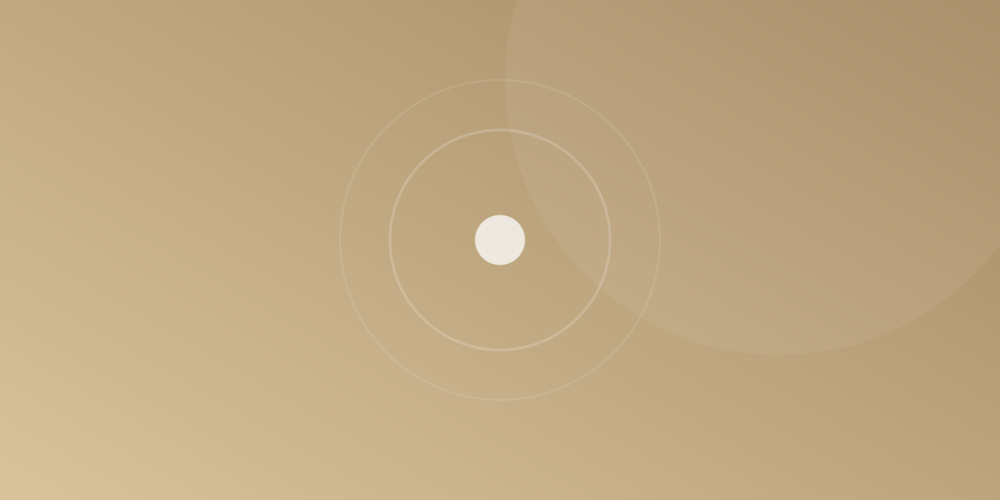

去年冬天我改一版设置页面。那之前我做过一轮「优化」，把每张卡片的上下内边距从 24px 压到 12px，理由是首屏能多露出半张卡片。上线第二天，有同事说这页「看着有点着急」。我当时不服气，直到自己连着用了三天才承认：问题不在信息量，而在我把那些空的地方当成了浪费。

## 空下来的地方，一直在做事情

我后来想明白了一件事：页面上的每一段空白，都在替内容说话。标题和正文之间那 8px，说的是「这是同一件事」；两段正文之间那 16px，说的是「换了个话题」；卡片之间那 24px，说的是「这里结束了」。把间距压小，等于把这些话全部改成同一句，读者就得自己重新判断谁和谁是一伙的。

留白是结构，不是剩下的空间。它不参与显示，但参与理解。

## 一个 8px 的栅格，把我从手感里救出来

以前我调间距靠「看着舒服」，结果是 13px、18px、22px 这种东西满地跑。整个页面没有哪两个数字是错的，合起来却总有轻微的抖动感。后来我干脆定死：所有间距必须是 4 的倍数，优先 8 的倍数——4、8、12、16、24、32、48。

自由少了很多，稳定多了太多。现在需要一个新的间距时，我不再问「多少好看」，只问一句：「这两块内容有多亲？」同一组内的元素用 8，同一段里换行用 12，换段用 16，换模块用 32。

## 行高比字号更影响可读性

这一段算是那次改版里最意外的一课。我原本打算把正文从 17px 调到 16px，理由是「更精致」。调完发现整页忽然变得很密，读两屏眼睛就累。真正的原因不是字号，是行高：17px 配 1.6 的时候，行距约 27px；16px 还是 1.5，行距掉到 24px，而中文的字身本来就比拉丁字母满，行距一紧，整块文字就成了一堵墙。

最后我做了很笨的一件事：字号回到 17px，行高固定 1.6，段间距给 1.25 个行高，把它们写成变量，之后再没随手改过。中文正文的行高我一般不会低于 1.6，长段落首选 1.7。

## 删东西比加东西难，但空出来的位置值得

改版收尾时我删掉了两样东西：设置项右侧那排灰色说明文字，以及每张卡片右上角的一枚状态小圆点。说明文字被收进了点击后的详情，圆点改成文字颜色本身来区分。

删完那一版，页面明显松了。奇怪的是信息一条都没少，只是不再同时喊出来。

> [!TIP]
> 如果你不确定一个页面是不是太挤，把浏览器缩放到 80% 看一眼。挤的地方会先暴露；如果缩到 80% 反而顺眼，那基本可以确定是间距不够，而不是内容太多。

留白不是把界面做空，而是给注意力排出先后。想清楚哪两块内容更亲，间距的数字自然就出来了——它其实一直是设计决策，只是长得像空白而已。
